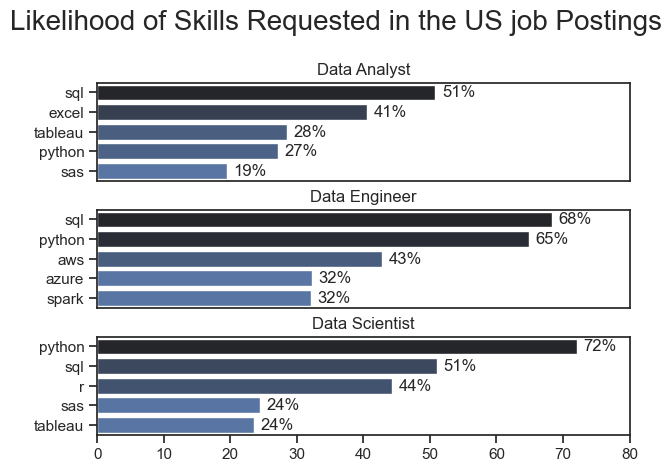
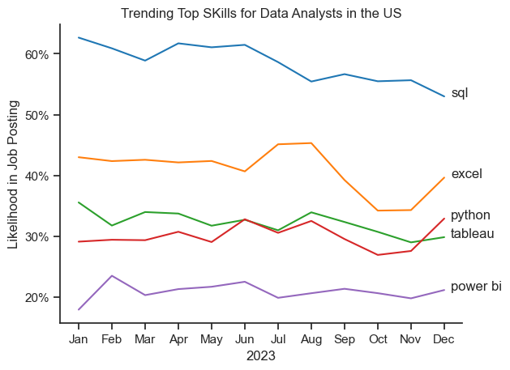
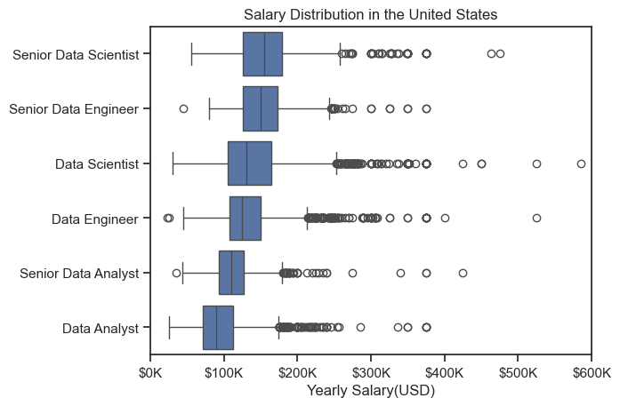
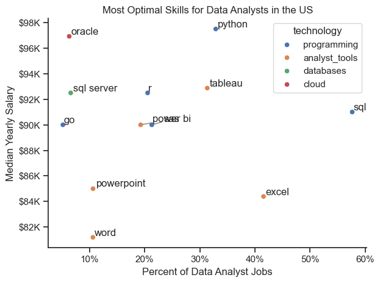

# Overview 
This project was created out of a desire to navigate and understand the job market more efficiently. It goes into the top-paying and in-demand skills to help find optimal job opportunites for data analysts.


The data sourced from `Luke Barousse's Python Course` which provides a foundation for my analysis, containing detailed information on job titles, salaries, locations, and essential skills. Through a series of Python scipts, I explore key questions such as the most demanded kills, salary trends, and the intersection of demand and salary in data analytics.


# The Questions
Below are the questions I want to answer in my project:

1. What are the skills most in demand for the top 3 most popular data roles?
2. How are in-demand skills trending for Data Analysts?
3. How well do jobs and skills pay for Data Analysts?
4. What are the optimal skills for data analysts to learn?

# Tools I Used 
Python: The backbone of my analysis, allowing me to analyze the data and find the critical insights. I also used the following Python libraries 
  
-Pandas: This was used to analyze the data

-MatPlotLib: I visualized the data 

-Seaborn: Helped me create more advanced visuals 

Jupyter Notebooks: The tool I used to run my Python scripts which let me easily include my notes and analysis.

Visual Studio Code: My go-to for executing Pythoin scripts 

Git & Github: Essential for verison controal and sharing my Python code and analysis.


# The Analysis 
## 1. What are the most demanded skills for the top 3 most popular data roles?

To find the most popular demanded skills for the top 3 most popular data roles. I filtered out those positions by which ones were the most popular, and got the top 5 skills for these top 3 roles. This query highlights the most popular job titles and their top skills, showing whcih skills I shoudl pay attention to depending on the role I'm targeting. 

View my notebook with detialed steps here : [Skills_Count.ipynb](Skills_Count.ipynb)
### Visualize Data
```python 
fig, ax = plt.subplots(len(job_titles),1)

sns.set_theme(style='ticks')

for i , job_title in enumerate(job_titles):
  df_plot = df_skills_perc[df_skills_perc['job_title_short'] == job_title].head(5)
  #df_plot.plot(kind='barh',x='job_skills',y='skill_percent',ax =ax[i],title=job_title)

  sns.barplot(data=df_plot, x='skill_percent',y='job_skills',ax=ax[i], hue='skill_count',palette='dark:b_r')
  ax[i].set_title(job_title)
  ax[i].set_ylabel('')
  ax[i].set_xlabel('')
  ax[i].get_legend().remove()
  ax[i].set_xlim(0,80)
  for n,v in enumerate(df_plot['skill_percent']):
    ax[i].text(v+1,n,f'{v:.0f}%',va='center')
  if i != len(job_titles) -1:
    ax[i].set_xticks([])
fig.suptitle('Likelihood of Skills Requested in the US job Postings',fontsize = 20)
fig.tight_layout(h_pad=.5)
plt.show()
```
### Results 

![Visulization of Likelihood of skills Requested in data jobs in the US]



### Insights 
Data Analyst:

SQL is the most requested skill, appearing in 51% of job postings. This indicates that SQL is essential for Data Analysts, highlighting its importance in querying and managing databases.
Excel follows with a significant 41% demand, showing its relevance for data manipulation and reporting.
Tableau and Python appear almost equally (28% and 27%, respectively), suggesting that both visualization and programming skills are becoming more essential for data analysis.
SAS appears in 19% of job postings, showing that while it is less commonly required, it still holds value in certain industries.

Data Engineer:

SQL and Python are dominant in this role, with 68% and 65% of job postings requesting these skills, respectively. This suggests strong proficiency in data management (SQL) and programming (Python) are crucial for Data Engineers.
AWS appears in 43% of job postings, emphasizing the importance of cloud infrastructure knowledge.
Azure and Spark both appear in 32% of postings, indicating that experience with cloud platforms and big data processing frameworks is also highly sought after.

Data Scientist:

Python is overwhelmingly the most requested skill, with 72% of job postings, indicating its central role in data science for tasks such as data manipulation, analysis, and machine learning.
SQL follows at 51%, showing its importance in database querying and managing data for analysis.
R is requested in 44% of job postings, demonstrating its continued relevance for statistical computing and data science.
Both SAS and Tableau appear equally at 24%, highlighting that while less common, these tools still have a notable presence in data science job requirements.
Overall Insights:
SQL and Python are universally in high demand across all three roles, with Python being especially critical for Data Scientists.
Cloud technologies (AWS, Azure) are becoming essential for Data Engineers, pointing to the increasing reliance on cloud infrastructure for data-related roles.
Data visualization skills (Tableau) are more prominent in Data Analyst roles, whereas programming and data processing skills (Python, Spark) are crucial for Data Scientists and Engineers.


## 2. How are in-demand skills trending for Data Analysts?

```Python
df_plot = df_DA_US_Percent.iloc[:,:5]

sns.lineplot(data=df_plot,dashes=False,palette='tab10')
sns.set_theme(style='ticks')
sns.despine()

plt.title('Trending Top SKills for Data Analysts in the US')
plt.ylabel('Likelihood in Job Posting')
plt.xlabel('2023')
plt.legend().remove()


from matplotlib.ticker import PercentFormatter
ax = plt.gca()
ax.yaxis.set_major_formatter(PercentFormatter(xmax=100,decimals=0))

for i in range(5):
  plt.text(11.2,df_plot.iloc[-1,i],df_plot.columns[i])
  ```

### Results
  

### Insights 
SQL:

SQL consistently remains the top requested skill, with its likelihood in job postings hovering around 60% throughout the year. While there's a slight decline from the start of the year to December, it is still the most in-demand skill for Data Analysts.

Excel:

Excel remains in steady demand, fluctuating between 40% and 45% over the year, with a notable dip in the latter part of the year before rising again in December. This suggests that spreadsheet proficiency continues to be a valuable skill, particularly for data manipulation and reporting.

Python:

Python's demand fluctuates around the 30% mark, indicating its continued importance for Data Analysts. However, its demand is notably lower than SQL, suggesting that while it's an important skill, it is less universally required compared to database skills.

Tableau:

Tableau remains consistently in demand around the 30% mark but slightly declines in the second half of the year. This suggests that visualization skills are essential but perhaps not as critical as SQL or Excel in Data Analyst roles.

Power BI:

Power BI is the least requested skill among the five, ranging between 20% and 25% throughout the year. While it is less demanded than Tableau, it still shows up in a notable portion of job postings, indicating that some employers prefer this alternative visualization tool.

Overall Insights:

SQL and Excel dominate the skills landscape for Data Analysts, with SQL being particularly essential.
Python and Tableau are both highly valued but seem to be secondary compared to SQL and Excel.
Power BI has a smaller presence but still demonstrates a significant demand, indicating that proficiency in multiple visualization tools (Power BI and Tableau) may be advantageous for Data Analysts.


## 3. How well do jobs and skills pay for Data Analysts?

### Salary Analysis

#### Visualize Data
```python
sns.boxplot(data=df_US_top6,x='salary_year_avg',y='job_title_short',order=job_order)
sns.set_theme(style='ticks')


plt.title('Salary Distribution in the United States')
plt.xlabel('Yearly Salary(USD)')
plt.ylabel('')
plt.xlim(0,600000)
ticks_x = plt.FuncFormatter(lambda y, pos: f'${int(y/1000)}K')
plt.gca().xaxis.set_major_formatter(ticks_x)
plt.show()
```
### Results



#### Insights 

Senior Data Scientist:

This role has the highest median salary, with most salaries falling between $150K and $200K.
There are several outliers, indicating that some Senior Data Scientists earn above $300K or even close to $600K.

Senior Data Engineer:

The salary distribution for Senior Data Engineers is slightly lower than Senior Data Scientists, with the median falling between $130K and $170K.
There are outliers above $300K, suggesting a similar potential for high earnings in this role.

Data Scientist:

The typical salary range for Data Scientists is between $100K and $150K, with a few outliers earning above $200K.
While the range is lower than for senior roles, Data Scientist positions still have a high earning potential.

Data Engineer:

The salary range for Data Engineers is comparable to that of Data Scientists, with a median around $100K-$150K.
There are more frequent outliers beyond $200K, suggesting that highly skilled Data Engineers may earn significantly more.

Senior Data Analyst:

Senior Data Analysts have a lower median salary than their Data Scientist or Data Engineer counterparts, typically earning between $80K and $120K.
While there are some outliers above $200K, they are fewer compared to more technical roles.

Data Analyst:

Data Analysts have the lowest salary range, with most earning between $60K and $100K.
The number of outliers is smaller, with few individuals earning above $150K, indicating a more limited salary ceiling compared to other data roles.

Overall Insights:

Senior positions (Senior Data Scientist, Senior Data Engineer) tend to have a much wider salary range and more outliers, reflecting the high earning potential and variability in compensation for experienced professionals.
Data Engineers and Data Scientists have similar salary distributions at both entry-level and senior levels, with slightly higher earning potential for Data Scientists in senior roles.
Data Analysts earn significantly less compared to Data Engineers and Scientists, reflecting the technical complexity and demand differences between these roles.

### Highest Paid & Most Demanded Skills for Data Analysts

#### Visualize Data

```python
fig, ax = plt.subplots(2, 1)

sns.set_theme(style='ticks')

# First barplot
sns.barplot(data=df_DA_top_pay, x='median', y=df_DA_top_pay.index, ax=ax[0], hue='median', palette='dark:b_r')
ax[0].legend().remove()
ax[0].set_title('Top 10 Highest Paid Skills for Data Analysts', pad=10)  # Adjust pad as needed
ax[0].set_ylabel('')
ax[0].set_xlabel('')
ax[0].xaxis.set_major_formatter(plt.FuncFormatter(lambda x, _: f'${int(x/1000)}K'))

# Second barplot
sns.barplot(data=df_DA_skills, x='median', y=df_DA_skills.index, ax=ax[1], hue='median', palette='light:b')
ax[1].legend().remove()
ax[1].set_title('Top 10 Most In-Demand Skills for Data Analysts', pad=10)  # Increased pad for lower title
ax[1].set_ylabel('')
ax[1].set_xlabel('Median Salary (USD)')
ax[1].set_xlim(ax[0].get_xlim())
ax[1].xaxis.set_major_formatter(plt.FuncFormatter(lambda x, _: f'${int(x/1000)}K'))

plt.tight_layout()

```

### Results 


The top graph shows specailized technical skills like `dplyr`, `Bitbucket`, and `Gitlab` are associated with higher salaries. some reaching up to $200k, suggesting that advanced technical proficiency can increase earning potential

The bottom graph highlights that foundational skills like `Excel`,`Powerpoint`, and `SQL` are the most in-demand, even though they may not ofer the highest salaries. This demonstrates the importance of these core skills for employability in data analysis roles.

There's a clear distinction between the skills that are highest paid and those that are most in-demand, Data analysts aiming to maximuze their career potential should consider developing a diverse skill set that includes both high-paying specialized skills and widely demanded foundational skills.


## 4. What is the most optimal skill to learn for Data Analysts?

#### Visualize Data

```python
from adjustText import adjust_text 

#df_plot.plot(kind='scatter',x='skill_percent',y='median_salary')
sns.scatterplot(
data= df_plot,
x ='skill_percent',
y = 'median_salary',
hue = 'technology'

)

sns.despine()
sns.set_theme(style='ticks')

texts = []

for i, txt in enumerate(df_DA_skills_high_demand.index):
  texts.append(plt.text(df_DA_skills_high_demand['skill_percent'].iloc[i], df_DA_skills_high_demand['median_salary'].iloc[i],txt))

#adjust_text(texts, arrowprops=dict(arrowstlye='->'), color = 'gray')

adjust_text(texts, arrowprops=dict(arrowstyle='->'), color='gray')


plt.ylabel('Median Yearly Salary')
plt.xlabel('Percent of Data Analyst Jobs')
plt.title('Most Optimal Skills for Data Analysts in the US')  

from matplotlib.ticker import PercentFormatter
ax = plt.gca()
ax.yaxis.set_major_formatter(plt.FuncFormatter(lambda y, pos: f'${int(y/1000)}K'))
ax.xaxis.set_major_formatter(PercentFormatter(xmax=100,decimals=0))
plt.tight_layout()
plt.show()
```


#### Results





#### Insights 

The scatter plot shows that most of `programming` skills (colored blue) tend to cluster at higher salary levels compared to other categories, indicating that programming expertise might offer greater salary benefits within the data analytics field.

Analyst tools (colored green), including Tableau and Power BI, are prevealent in job postings and offer competitve salaries, showing that visualization and data analysis software are crucial for current data roles. This category not only has good salaries but is also veristile across different types of data tasks.

The database skills (colored orange), such as Oracle and SQL Server, are associated with some of the highest salaries amoung data analyst tools. This indicates a significant demand and valuation for data management and manipulation expertise in the industry.


# Conclusion 

This exploration into the data analyst job market has been incredibly informative, highlighting the critical skills and trends that shape this evolving field. The insightsI got enhance my understanding and provide actionable guidance for anyone looking to advance their career in data analytics. As the market continues to change, ongoing analysis will be essential to stay ahead in data analytics. This project is a good foundation for future explorations and underscores the importance of continuous learning and adaption in the data field.